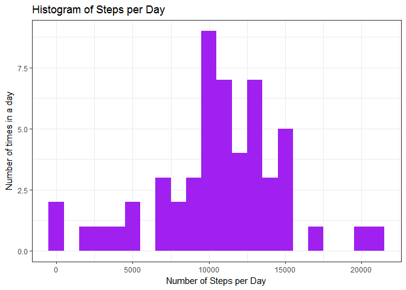
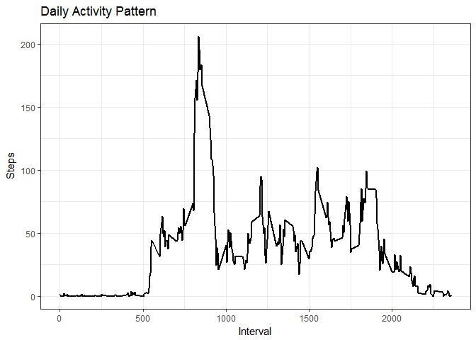
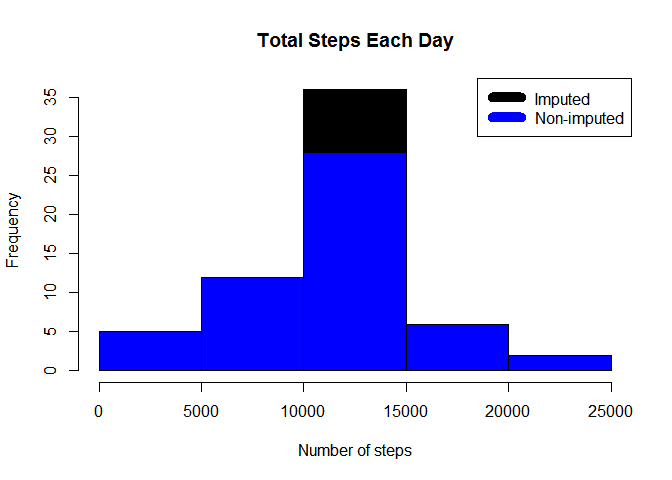
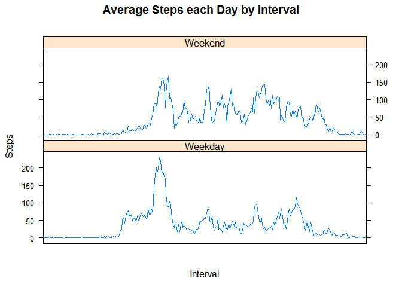

PA1\_template.Rmd
================

Loading and preprocessing the data
----------------------------------

``` r
library("data.table")
library(ggplot2)
 
## download and unzip data file
if (!file.exists("activity.csv") ){
     dlurl <- 'http://d396qusza40orc.cloudfront.net/repdata%2Fdata%2Factivity.zip'  
     download.file(dlurl,destfile='repdata%2Fdata%2Factivity.zip',mode='wb')  
     unzip('repdata%2Fdata%2Factivity.zip')
}

## read data in adn check the dimensions and a few rows of the dataset
activityData <- read.csv ("activity.csv", header = T, sep = ",", stringsAsFactors = F)
activityData$date <- as.Date(activityData$date, format = "%Y-%m-%d")
activityData$interval <- as.factor(activityData$interval)

dim(activityData)
```

    ## [1] 17568     3

``` r
head(activityData )
```

    ##   steps       date interval
    ## 1    NA 2012-10-01        0
    ## 2    NA 2012-10-01        5
    ## 3    NA 2012-10-01       10
    ## 4    NA 2012-10-01       15
    ## 5    NA 2012-10-01       20
    ## 6    NA 2012-10-01       25

``` r
str(activityData)
```

    ## 'data.frame':    17568 obs. of  3 variables:
    ##  $ steps   : int  NA NA NA NA NA NA NA NA NA NA ...
    ##  $ date    : Date, format: "2012-10-01" "2012-10-01" ...
    ##  $ interval: Factor w/ 288 levels "0","5","10","15",..: 1 2 3 4 5 6 7 8 9 10 ...

What is mean total number of steps taken per day?
-------------------------------------------------

##### 1.Calculate the total number of steps taken per day

##### Make a histogram of the total number of steps taken each day

``` r
steps_Day <- aggregate(steps ~ date, activityData, sum)
colnames(steps_Day) <- c("date","steps")
head(steps_Day)
```

    ##         date steps
    ## 1 2012-10-02   126
    ## 2 2012-10-03 11352
    ## 3 2012-10-04 12116
    ## 4 2012-10-05 13294
    ## 5 2012-10-06 15420
    ## 6 2012-10-07 11015

``` r
ggplot(steps_Day , aes(x = steps)) + 
       geom_histogram(fill = "purple", binwidth = 1000) + 
       labs(title="Histogram of Steps per Day", 
       x = "Number of Steps per Day", 
       y = "Number of times in a day") + 
       theme_bw() 
```



##### Calculate and report the mean and median of the total number of steps taken per day

``` r
stepsPerDay_mean   <- mean(steps_Day$steps, na.rm=TRUE)
stepsPerDay_median <- median(steps_Day$steps, na.rm=TRUE)

stepsPerDay_mean
```

    ## [1] 10766.19

``` r
stepsPerDay_median 
```

    ## [1] 10765

What is the average daily activity pattern?
-------------------------------------------

##### What is the average daily activity pattern?

##### 1.Make a time series plot of the 5-minute interval (x-axis)

##### and the average number of steps taken, averaged across all days (y-axis)

``` r
stepsEach_Interval <- aggregate(activityData$steps, 
                                by = list(interval =activityData$interval),
                                FUN=mean, na.rm=TRUE)
 
stepsEach_Interval$interval <- as.integer(levels(stepsEach_Interval$interval)[stepsEach_Interval$interval])
 colnames(stepsEach_Interval) <- c("Interval", "Steps")

ggplot(stepsEach_Interval, aes(x=Interval, y=Steps)) +   
        geom_line(color="black", size=1) +  
        labs(title="Daily Activity Pattern", x="Interval", y="Steps") +  
        theme_bw()
```



##### 2.Which 5-minute interval, on average across all the days in the dataset,

##### contains the maximum number of steps?

``` r
max_interval <- stepsEach_Interval[which.max(stepsEach_Interval$Steps),1]
max_interval
```

    ## [1] 835

Imputing missing values
-----------------------

##### Note that there are a number of days/intervals where there are missing values (coded as NA).

##### The presence of missing days may introduce bias into some calculations or summaries of the data.

##### Calculate and report the total number of missing values in the dataset (i.e. the total number of rows with NAs)

##### Devise a strategy for filling in all of the missing values in the dataset. The strategy does not need to

##### be sophisticated. For example, you could use the mean/median for that day, or the mean for that 5-minute interval, etc.

##### Create a new dataset that is equal to the original dataset but with the missing data filled in.

##### Make a histogram of the total number of steps taken each day and Calculate and report the mean and

##### median total number of steps taken per day. Do these values differ from the estimates from the

##### first part of the assignment? What is the impact of imputing missing data on the estimates

##### of the total daily number of steps?

``` r
missingValues <- sum(is.na(activityData$steps))
missingValues 
```

    ## [1] 2304

``` r
StepsAverage_eachInterval <- aggregate(steps ~ interval, data =  activityData, FUN = mean)

newStepsColwithoutNA <- numeric()

for (i in 1:nrow(activityData)) {
    n <- activityData[i, ]
    if (is.na(n$steps)) {
        steps <- subset(StepsAverage_eachInterval, interval == n$interval)$steps
    } else {
        steps <- n$steps
    }
    newStepsColwithoutNA <- c(newStepsColwithoutNA , steps)
}

activityData_2 <- activityData
activityData_2$steps <- newStepsColwithoutNA 


totalStepsEachDay <- aggregate(steps ~ date, data = activityData_2, sum, na.rm = TRUE)

hist(totalStepsEachDay$steps, main = paste("Total Steps Each Day"), col="black", xlab="Number of steps")

hist(steps_Day$steps, main = paste("Total Steps Each Day"), col="blue", xlab="Number of Steps", add=T)
legend("topright", c("Imputed", "Non-imputed"), col=c("black", "blue"), lwd=10) 
```



``` r
stepsNoNA_mean   <- mean(totalStepsEachDay$steps )
stepsNoNA_median <- median(totalStepsEachDay$steps)

stepsNoNA_mean 
```

    ## [1] 10766.19

``` r
stepsNoNA_median
```

    ## [1] 10766.19

``` r
diffMean <- stepsPerDay_mean - stepsNoNA_mean 
diffMedian <- stepsPerDay_median -stepsNoNA_median
  
diffMean
```

    ## [1] 0

``` r
diffMedian
```

    ## [1] -1.188679

Are there differences in activity patterns between weekdays and weekends?
-------------------------------------------------------------------------

##### For this part the weekdays() function may be of some help here.

##### Use the dataset with the filled-in missing values for this part.

##### 1.Create a new factor variable in the dataset with two levels – “weekday” and “weekend” indicating

##### whether a given date is a weekday or weekend day.

``` r
wkdays <- c( 1 ,2 ,3 ,4 ,5 )
 

activityData_2$dow = as.factor(ifelse(is.element( format(as.Date(activityData_2$date) , "%w" ) ,wkdays), "Weekday","Weekend"))
 

TotalStepsDOW <- aggregate(steps ~ interval + dow, activityData_2 , mean)
head(TotalStepsDOW )
```

    ##   interval     dow      steps
    ## 1        0 Weekday 2.25115304
    ## 2        5 Weekday 0.44528302
    ## 3       10 Weekday 0.17316562
    ## 4       15 Weekday 0.19790356
    ## 5       20 Weekday 0.09895178
    ## 6       25 Weekday 1.59035639

##### 2.Make a panel plot containing a time series plot (i.e. type = "l") of the 5-minute

##### interval (x-axis) and the average number of steps taken, averaged across all weekday days or

##### weekend days (y-axis). See the README file in the GitHub repository to see an example of what

##### this plot should look like using simulated data.

``` r
## install.packages("lattice", repos="http://cran.r-project.org")

library(lattice)
xyplot(TotalStepsDOW$steps ~ TotalStepsDOW$interval | TotalStepsDOW$dow, main="Average Steps each Day by Interval",xlab="Interval", ylab="Steps",layout=c(1,2 ), type="l" ,scales=list(x=list(at=NULL)) )
```


